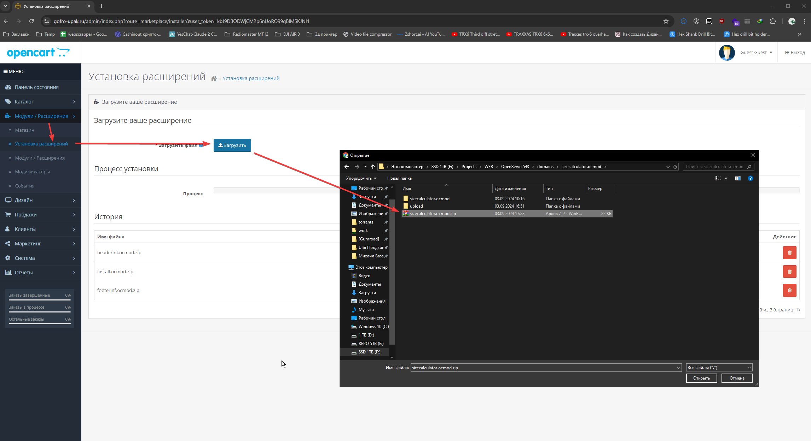
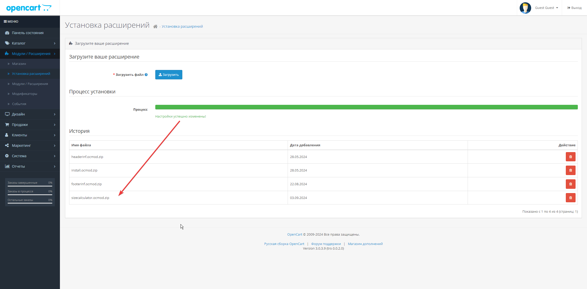
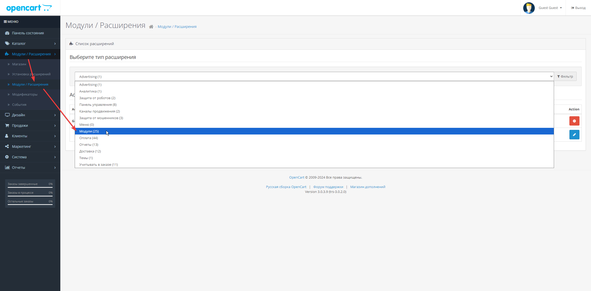
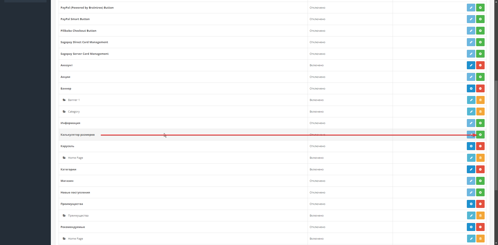
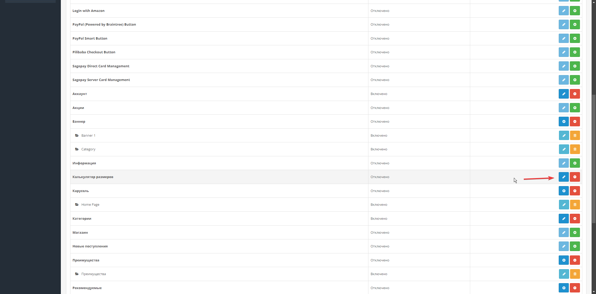
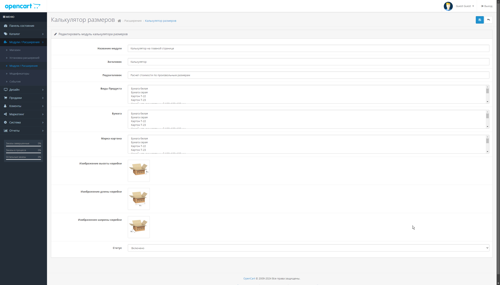
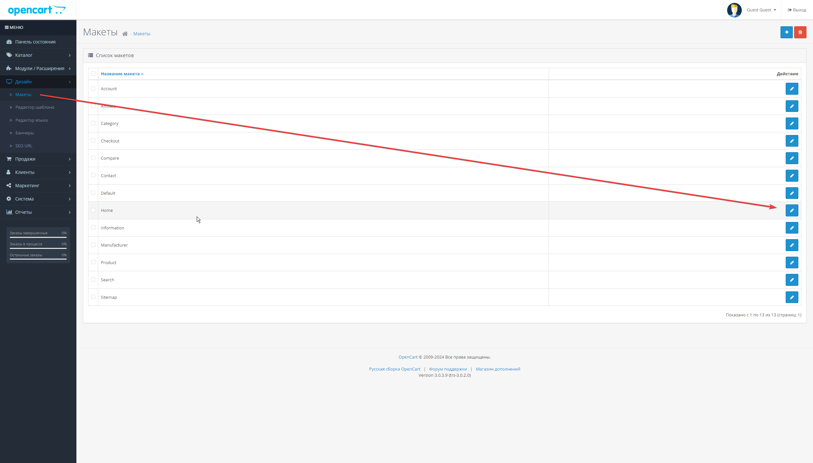
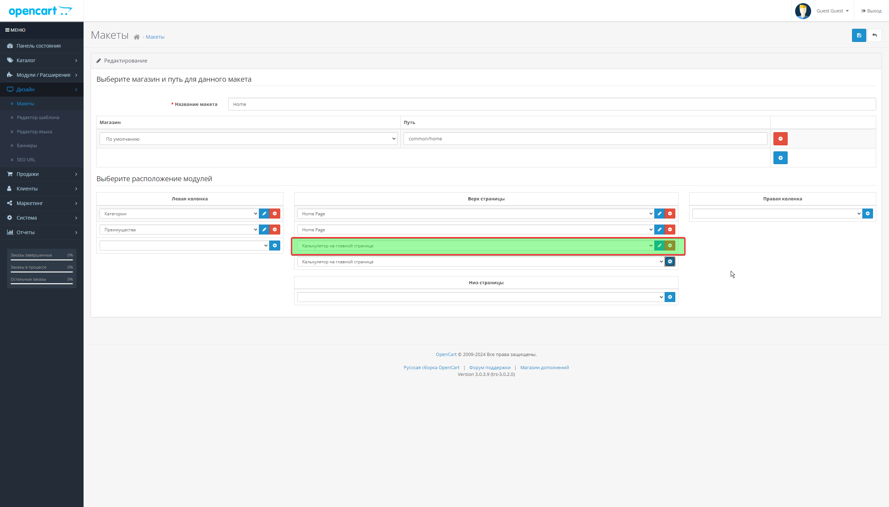
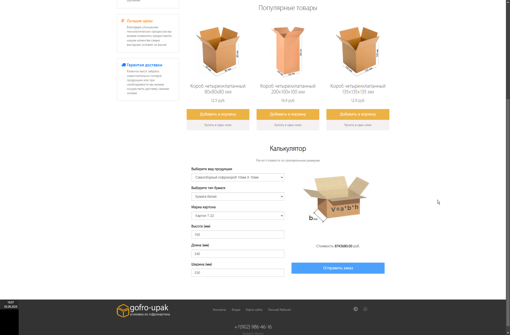
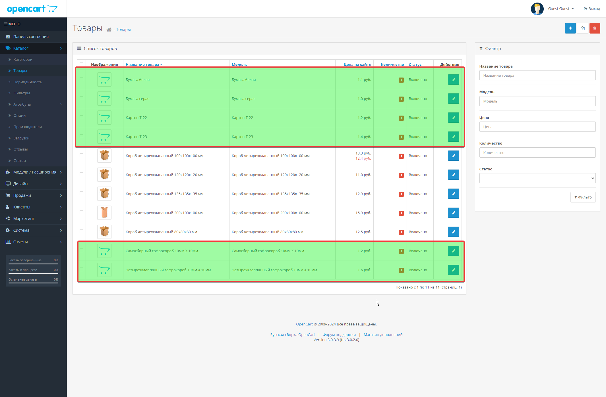

# Модуль Калькулятор размеров

Это пользовательский модуль для OpenCart, который предоставляет калькулятор размеров для различных типов продуктов. Модуль позволяет пользователям вводить размеры коробки (высота, ширина, длина) и получать соответствующие результаты.

## Возможности
- Расчет размеров для разных типов продуктов (например, бумага, картон).
- Многоязычная поддержка (английский, русский).
- Простой и удобный интерфейс для ввода размеров.
- Модуль для админ-панели с настройками заголовка, подзаголовка и других параметров.
- Интерфейс для пользователей на фронтенде для выполнения расчетов.

## Структура модуля
```
┣ 📂admin
┃ ┣ 📂controller
┃ ┃ ┗ 📂extension
┃ ┃ ┃ ┗ 📂module
┃ ┃ ┃ ┃ ┗ 📜sizecalculator.php # Контроллер для админ-панели
┃ ┣ 📂language
┃ ┃ ┣ 📂en-gb
┃ ┃ ┃ ┗ 📂extension
┃ ┃ ┃ ┃ ┗ 📂module
┃ ┃ ┃ ┃ ┃ ┗ 📜sizecalculator.php # Языковой файл для админ-панели (английский)
┃ ┃ ┗ 📂ru-ru
┃ ┃ ┃ ┗ 📂extension
┃ ┃ ┃ ┃ ┗ 📂module
┃ ┃ ┃ ┃ ┃ ┗ 📜sizecalculator.php # Языковой файл для админ-панели (русский)
┃ ┗ 📂view
┃ ┃ ┗ 📂template
┃ ┃ ┃ ┗ 📂extension
┃ ┃ ┃ ┃ ┗ 📂module
┃ ┃ ┃ ┃ ┃ ┗ 📜sizecalculator.twig # Шаблон для админ-панели
┗ 📂catalog
┃ ┣ 📂controller
┃ ┃ ┗ 📂extension
┃ ┃ ┃ ┗ 📂module
┃ ┃ ┃ ┃ ┗ 📜sizecalculator.php # Контроллер для фронтенда
┃ ┣ 📂language
┃ ┃ ┣ 📂en-gb
┃ ┃ ┃ ┗ 📂extension
┃ ┃ ┃ ┃ ┗ 📂module
┃ ┃ ┃ ┃ ┃ ┗ 📜sizecalculator.php # Языковой файл для фронтенда (английский)
┃ ┃ ┗ 📂ru-ru
┃ ┃ ┃ ┗ 📂extension
┃ ┃ ┃ ┃ ┗ 📂module
┃ ┃ ┃ ┃ ┃ ┗ 📜sizecalculator.php # Языковой файл для фронтенда (русский)
┃ ┗ 📂view
┃ ┃ ┣ 📂javascript
┃ ┃ ┃ ┗ 📜sizecalculator.js # JavaScript для фронтенда
┃ ┃ ┗ 📂theme
┃ ┃ ┃ ┗ 📂default
┃ ┃ ┃ ┃ ┣ 📂extension
┃ ┃ ┃ ┃ ┃ ┗ 📂module
┃ ┃ ┃ ┃ ┃ ┃ ┗ 📜sizecalculator.twig # Шаблон для фронтенда
┃ ┃ ┃ ┃ ┗ 📂stylesheet
┃ ┃ ┃ ┃ ┃ ┗ 📜sizecalculator.css # CSS для фронтенда
```

## Установка

1. Скопируйте все файлы модуля в соответствующие каталоги в вашей установке OpenCart.
2. В админ-панели перейдите в **Extensions > Modules** и установите модуль "Калькулятор размеров".
3. Настройте модуль, указав необходимые параметры, такие как заголовок, типы продуктов и изображения для расчета размеров.

## Использование

После установки калькулятор размеров будет доступен на фронтенде вашего магазина, что позволит пользователям рассчитать размеры продуктов на основе введенных ими данных. Модуль можно настраивать в админ-панели.

## Переводы

Модуль поддерживает следующие языки:
- **Английский** (en-gb)
- **Русский** (ru-ru)

Вы можете добавить больше языков, создав соответствующие языковые файлы в директориях `language`.

## Файлы

- **Контроллеры**: Отвечают за логику работы модуля как в админ-панели, так и на фронтенде.
- **Шаблоны**: Twig-шаблоны для отображения пользовательского интерфейса.
- **Языки**: Содержат языковые определения для админки и фронтенда.
- **Ресурсы**: Включают JavaScript и CSS файлы для фронтенда.


## Установка фото









